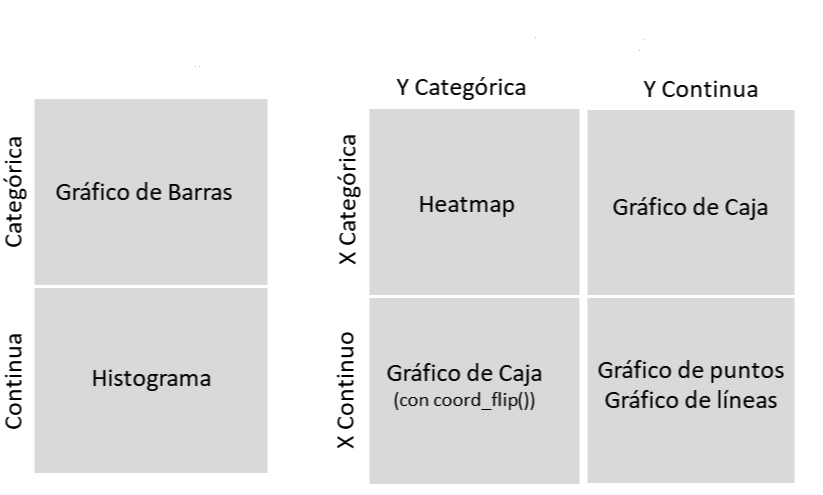

---
output:
  xaringan::moon_reader:
    lib_dir: libs
    css:  ["default", "default-fonts", "animate.css",  "hygge"]
    nature:
      highlightStyle: github
      highlightLines: true
      highlightSpans: true
      countIncrementalSlides: true
---
class: inverse, center
```{r , message=FALSE, warning=FALSE, include=FALSE} 
library(fontawesome)
library(emo)
library(tidyverse)
library(datos)
library(knitr)
```

# `r fa("r-project", fill = 'steelblue')`  para análisis de datos <br> <br> 

## `Visualización` <br> <br> <br> 

.large[Roxana N. Villafañe | LEMyP | <a href='http://twitter.com/data_datum'>`r fa("twitter", fill = 'steelblue')` @data_datum</a>] <br> 
.large[Florencia D'Andrea | INTA-CONICET | <a href="http://twitter.com/cantoflor_87"> `r fa("twitter", fill = 'steelblue')` @cantoflor_87</a><br>] 


<br><br><br><br><br> Slides disponibles en <https://flor14.github.io/visualizacion_2020/visualizacion#1> `r emo::ji("sparkles")`
<br> Página web del curso en <https://flor14.github.io/Curso_r_unne_2020/> `r emo::ji("star2")`


---

# Exploración de datos

```{r visu, echo=FALSE, fig.align = "center"}
knitr::include_graphics("visualizar.png")
```

.footnote[**Fuente**: https://es.r4ds.hadley.nz/explorar-introduccion.html]
---

class: center, middle

# Paquete `ggplot2`

```{r hex, echo=FALSE, out.width = "300px", fig.align = "center"}
knitr::include_graphics("hex.png")
```

---

# Guía Rápida

```{r cheat, echo=FALSE, out.width = "600px", fig.align = "center"}
knitr::include_graphics("cheatsheet.png")
```

.footnote[**Fuente**: RStudio Cheatsheet]
---

class: middle, inverse

# ggplot2 📈

---


# Gramática de los gráficos

```{r ggplotplot, eval=FALSE}
library(tidyverse)
library(datos)

ggplot(data = `<DATOS>`) +
  `<GEOM_FUNCIÓN>`(mapping = aes(`<MAPEOS ESTÉTICOS>`))
```


```{r layers1, echo=FALSE, out.width = "600px", fig.align = "center"}
knitr::include_graphics("layers_1.png")
```

.footnote[**Fuente**: RStudio Cheatsheet]

---


# Gramática de los gráficos

```{r ggplot, eval=FALSE}
library(tidyverse)
library(datos)

ggplot(data = `<DATOS>`) +
  `<GEOM_FUNCIÓN>`(mapping = aes(`<MAPEOS ESTÉTICOS>`))
```

```{r graficos, echo=FALSE, out.width = "600px", fig.align = "center"}
knitr::include_graphics("graficos.png")
```

.footnote[**Fuente**: RStudio Cheatsheet]

---


# Datos

Dataset `millas` en español traducido por la comunidad **R4DS**

```{r eval=FALSE, include=FALSE}
install.package("datos")
library(datos)
```


```{r r4dses, echo=FALSE, out.width = "200px", fig.align = "center"}
knitr::include_graphics("r4dses.png")
```

---

class: middle, inverse

# Función Geom

---


# Función Geom

```{r ggplo44t, eval=FALSE}
library(tidyverse)
library(datos)

ggplot(data = <DATOS>) +
  `<GEOM_FUNCIÓN>`(mapping = aes(<MAPEOS>))
```

Las funciones `geom_*()` representan los datos. 

Cada función geom que uso forma una capa.

```{r geomexamples, echo=FALSE, out.width = "200px", fig.align = "center"}
knitr::include_graphics("geom_examples.png")
```
.footnote[**Fuente**: RStudio Cheatsheet]

---

class: middle, inverse

# Mapeos

---


# Mapeos 

El mapeo entre las propiedades estéticas de tu gráfico y las variables de tu dataset te permite comunicar información sobre tus datos.

```{r ggplo444t, eval=FALSE}
library(tidyverse)
library(datos)

ggplot(data = <DATOS>) +
  <GEOM_FUNCIÓN>(mapping = `aes(<MAPEOS>)`)
```

---


# Mapeos 

Para mapear (o asignar) una estética a una variable, debes asociar el nombre de la estética al de la variable dentro de `aes()`.

```{r aes, echo=FALSE, out.width = "500px", fig.align = "center"}

```


---


Puedo incluir información de 3 variables en el gráfico si uso argumentos

```{r ggplot2, echo=TRUE, fig.width=7, fig.height=5, fig.align = "center"}

library(tidyverse)
library(datos)

ggplot(data = millas) +
  geom_point(mapping = aes(x = motor,
                           y = autopista,
                           color = clase))
```

---

class: middle, inverse, center

# 💡💻
# Demo #1

Generar un gráfico con `ggplot2`

Modificar las funciones `geom` y los mapeos

---


# Algunos ejemplos de gráficos

```{r gordi, echo=FALSE, out.width = "900px"}

```

---

class: middle, inverse

# Gráfico de Barras

---


# `geom_bar()`

```{r bar, fig.width=7, fig.height=5, fig.align = "center"}
library(tidyverse)

ggplot(diamonds) +
geom_bar(aes(x = color))

```

.footnote[**Fuente**: RStudio Primers]
---


# `geom_col()`

```{r col, fig.width=7, fig.height=5, fig.align = "center"}
library(tidyverse)

ggplot(diamonds) +
geom_col(aes(x = color, y = price))

```

---


# Argumentos `color` y `fill` 

¿Te animas a reproducir estos gráficos?

Acordate que siempre podes consultar la ayuda para chequear los argumentos.


```{r fill, echo=FALSE, out.width = "600px", fig.align = "center"}
knitr::include_graphics("fill vs color.png")

```

.footnote[**Fuente**: RStudio Primers - Visualize data]

---


# Cuidado! 

position = "fill"

position = "stack"

position = "dodge"

```{r pos_adj, echo=FALSE, out.width = "400px", fig.align = "center"}
knitr::include_graphics("position_adj.png")
```


Recomiendo: [RStudio Primers](https://rstudio.cloud/learn/primers/3.2)

---

class: middle, inverse, center

# 💡💻
# Demo #2

Genero un gráfico de barras.

¿Qué pasa si modifico el argumento `position`? 

---

class: middle, inverse

# Histograma


---


# Histograma

Ajusta el ancho del bin (contenedor) para revelar nueva información

```{r histo, echo=FALSE, fig.width=7, fig.height=5, fig.align = "center"}

library(datos)

ggplot(data = diamantes) +
  geom_histogram(mapping = aes(x = precio))
```

---

class: middle, inverse

# Grafico de caja 

---


# Grafico de caja

los diagramas de caja (boxplots) calculan un resumen robusto de la distribución y luego muestran una caja con formato especial.

```{r caja, echo=TRUE, fig.align= "center", fig.height=5, fig.width=7}
library(datos)
ggplot(data = millas) +
  geom_boxplot(mapping = aes(x = clase,
                             y = autopista))

```


---


# Giro el sistema de coordenadas

```{r graficos22, echo=FALSE, out.width = "300px", fig.align = "center"}
knitr::include_graphics("graficos.png")
```


```{r caja2, echo=TRUE, fig.align= "center", fig.height=4, fig.width=6}

library(datos)
ggplot(data = millas)+
  geom_boxplot(mapping = aes(x = clase, y = autopista))+
  coord_flip()

```


---

class: middle, inverse

# Gráfico de puntos (_scatterplot_)
# Grafico de líneas

---


# Gráfico de puntos

Uso el argumento `color` para mapear una tercer variable

```{r puntos, echo=TRUE, fig.align= "center", fig.height=5, fig.width=7}
ggplot(data = millas) +
  geom_point(mapping = aes(x = motor,
                           y = autopista,
                           color = clase))
```

---


# Gráfico de puntos

Si quiero observar tercer variable pero continua puedo usar otro argumento, como `size`

```{r size, echo=TRUE, fig.align= "center", fig.height=5, fig.width=7}

ggplot(data = millas)+
  geom_point(mapping = aes(x = motor, y = autopista, size = cilindros))
             
```

---


# Gráfico de líneas

```{r lineas, echo=TRUE, fig.align= "center", fig.height=5, fig.width=7}

library(gapminder)

gapminder %>% 
filter(country %in% c("Argentina","Brazil","Chile"))%>% 
ggplot() +
  geom_line(aes(x = year, y = pop, color = country),
            size = 1.5)
```


---

class: middle, inverse, center

# 💡💻
# Demo #3

¿Cómo hago un gráfico que combina líneas y puntos?

Entiendo que los gráficos tienen capas

---


# Ejercicio 

¿Por qué los puntos se ven rosados?
¿Qué pasa si sacas el argumento `color = "blue"` fuera de `aes()`?


```{r rere, echo=TRUE, fig.align= "center", fig.height=5, fig.width=7}
 ggplot(data = millas) +
   geom_point(mapping = aes(x = motor, y = autopista, color = "blue"))
```

---

class: middle, inverse

# Heatmap

---


# `geom_tile()`

```{r tile, echo=TRUE, fig.align= "center", fig.height=5, fig.width=7}

ggplot(airquality, aes(x = Month, y = Day)) +
  geom_tile(aes(fill=Temp))+
  scale_fill_gradient(name = 'Temperature', low = 'white', high = 'red')+
  labs(title="Temperature Readings by Date") 
  
```

.footnote[http://analyticswithr.com/dataviz.html]

---


# Puede ser mas complejo

```{r heat, echo=FALSE, out.width="400px", fig.align = "center"}

knitr::include_graphics("superheatmap.png")
```

---

class: middle, inverse

# Escalas de colores 📊

---

# Tipos de escalas

Divergente, secuencial y cualitativa

```{r escalas, echo=FALSE, out.width = "500px", fig.align = "center"}

knitr::include_graphics("escalas.png")

```

---

# Un paquete con paletas de colores

¿Cuales son paletas divergentes/secuenciales/cualitativas?

Otra paleta es `viridis` 

```{r heater, echo=TRUE, fig.align= "center", fig.height=7, fig.width=9}

library(RColorBrewer)
RColorBrewer::display.brewer.all()

```

---

```{r holala, echo=TRUE, fig.align= "center", fig.height=5, fig.width=7}
library(tidyverse)
library(datos)

dsamp <- sample_n(diamantes, size = 1000)

ggplot(dsamp,
       aes(quilate, precio, colour = claridad))+
  geom_point()+
  scale_colour_brewer(palette = "Set1")

```

---

class: middle, inverse

# Facetas

Funciones `facet_grid` y `facet_wrap`

---


# `facet_wrap()`

Es más útil si tiene una sola variable con muchos niveles. 

`nrow` y/o `ncol` son argumentos útiles.

```{r wrap, fig.width=6, fig.height=4, fig.align = "center"}
library(datos)

ggplot(diamantes) + 
  geom_bar(aes(x = color, fill = corte)) +
  facet_wrap(~corte)

```

---


# `facet_grid()`

Es más útil cuando tiene dos variables discretas, y todas las combinaciones de las variables existen en los datos.

```{r grip, fig.width=6, fig.height=4, fig.align = "center"}
library(datos)

ggplot(diamantes) + 
  geom_bar(aes(x = color, fill = corte)) +
  facet_grid(claridad~corte)

```

---

class: center, middle, inverse

# 💡💻
# Demo #4

Probemos todas las posibilidades de gráficos con `facet_wrap()` y `facet_grid()`

¿Qué pasa si empleo una variable continua para el facetado?


---


# Temas

Puedes encontrar más temas en el paquete [ggthemes](https://www.ggplot2-exts.org/ggthemes.html)

```{r themes1, echo=FALSE, fig.align="center", fig.height=5, fig.width=7, message=FALSE, warning=FALSE}

library(tidyverse)
library(gridExtra)
options(warn=-1)
p <- ggplot(mtcars) + geom_point(aes(x = wt, y = mpg,
     colour = factor(gear))) + facet_wrap(~am) + labs(colour = "Gear")
p1 = p + theme_gray() + labs(title = "theme_gray")
p2 = p + theme_bw() + labs(title = "theme_bw")
p3 = p + theme_linedraw() + labs(title = "theme_linedraw")
p4 = p + theme_light() + labs(title = "theme_light")
p5 = p + theme_dark() + labs(title = "theme_dark")
p6 = p + theme_minimal() + labs(title = "theme_minimal")
p7 = p + theme_classic() + labs(title = "theme_classic")
p8 = p + theme_void() + labs(title = "theme_void")
grid.arrange(p1,p2,p3,p4)
```

.footnote[https://garthtarr.github.io/meatR/ggplot_extensions.html]

---


# Temas

```{r themes2, echo=FALSE, fig.align="center", fig.height=5, fig.width=7, message=FALSE, warning=FALSE}
library(tidyverse)
library(gridExtra)
options(warn=-1)
p <- ggplot(mtcars) + geom_point(aes(x = wt, y = mpg,
     colour = factor(gear))) + facet_wrap(~am) + labs(colour = "Gear")
p1 = p + theme_gray() + labs(title = "theme_gray")
p2 = p + theme_bw() + labs(title = "theme_bw")
p3 = p + theme_linedraw() + labs(title = "theme_linedraw")
p4 = p + theme_light() + labs(title = "theme_light")
p5 = p + theme_dark() + labs(title = "theme_dark")
p6 = p + theme_minimal() + labs(title = "theme_minimal")
p7 = p + theme_classic() + labs(title = "theme_classic")
p8 = p + theme_void() + labs(title = "theme_void")
grid.arrange(p5,p6,p7,p8)
```


.footnote[https://garthtarr.github.io/meatR/ggplot_extensions.html]

---


# Ejes

## Cambio de nombre a los ejes

```{r ejes, echo=FALSE, fig.align = "center", fig.height=5, fig.width=7, message=FALSE, warning=FALSE}

ggplot(millas, aes(motor, autopista)) +
  geom_point(aes(colour = clase)) +
  geom_smooth(se = FALSE) +
  labs(
    x = "Desplazamiento del motor (L)",
    y = "Economia de combustible de carretera (millas)",
    colour = "Tipo de automóvil",
    title = "Mi grafico"
  ) 

```

---

class: center, middle, inverse

# 💡💻
# Demo #5

Mapas 

Plotly


---

class: center, middle, inverse

# Links

[ggplot2 Book](https://ggplot2-book.org/)

[R4DS español](https://es.r4ds.hadley.nz/)

[Rcookbook](http://www.cookbook-r.com/)

---

background-image: url(img/textura-fondo.png)
background-size: cover
class: center, middle, inverse

 

# `r emo::ji("raising_hand")` ¿Preguntas?


---


